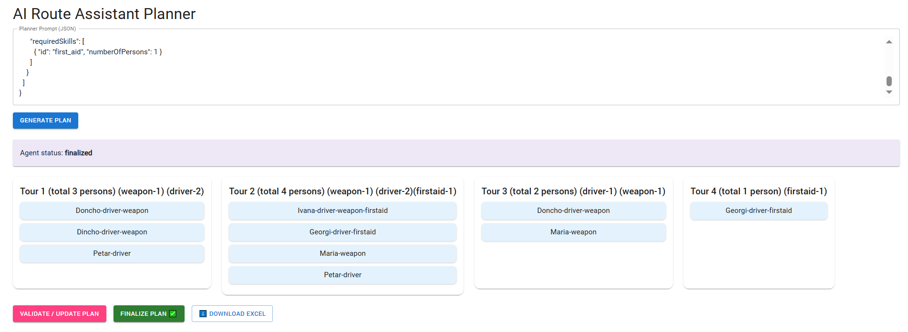

# 🧭 Azure AI Route Assistant Planner

A full-stack logistics planner powered by **Azure AI Foundry Agents**, enabling intelligent assignment of team members to logistics tours based on their skills and requirements.

This project includes:
- A **custom Azure AI Agent** (“Route Assignment Agent”) with structured JSON input/output behavior  
- A **Node.js + Express** backend that communicates with the Azure AI Foundry API  
- A **React + Material-UI** frontend with drag-and-drop tour planning, validation, and Excel export

---
## Backend Setup
!!! You should have node installed globally in you system.

navigate to server folder and run
npm install
npm node.server.js

Backend runs on: http://localhost:5000

API Endpoints
Method	Endpoint	Description
POST /api/run-agent	Sends persons + tours → gets AI-generated plan
POST /api/update-agent	Sends updated assignments + persons + tours → gets AI validation
POST /api/finalize-agent	Confirms final plan → AI returns unchanged plan

## Frontend Setup
in the root folder run
npm install
npm start

Frontend runs on: http://localhost:3000

## 🚀 Features

✅ Plan, validate, and finalize assignments for logistics tours  
✅ Azure AI Agent performs reasoning based on skill requirements  
✅ Drag-and-drop interface to rearrange or manually reassign persons  
✅ Automatic validation and correction of invalid plans  
✅ Download the finalized plan as an **Excel (.xlsx)** file  
✅ Clean separation between backend (AI integration) and frontend (UI)

---

## 🧠 Azure AI Foundry Agent — Instructions

This project uses a **custom agent** hosted in Azure AI Foundry with the following behavior and rules.

Agent instructions:

You are a Route Assignment Agent that plans, validates, and finalizes team assignments for logistics tours.

Your job is to:

Create assignments between people and tours based on their skills and requirements.

Validate and correct existing assignments when provided.

Finalize assignments when requested, returning the exact plan unchanged.

INPUT STRUCTURE

You will always receive JSON input that includes a field called "mode":

{
"mode": "plan" | "validate" | "finalize",
"data": { ... }
}

WHEN mode = "plan"

You must generate a new assignment plan.

Example input:
{
"mode": "plan",
"data": {
"persons": [
{ "name": "Doncho", "skills": ["driver_license", "weapon"] },
{ "name": "Ivana", "skills": ["driver_license", "first_aid"] }
],
"tours": [
{
"name": "Tour 1",
"numberOfPersons": 2,
"requiredSkills": [
{ "id": "driver_license", "numberOfPersons": 2 }
]
}
]
}
}

You must:

Assign people so each tour’s required skills are covered.

Respect each tour’s numberOfPersons.

Balance workload evenly across all persons.

If a tour cannot be fully staffed, include it under "unassignedTours" with missing skills.

WHEN mode = "validate"

You must review an existing plan that also includes the persons and tours context.
If assignments do not meet the requirements, fix them or explain what changes are needed.

Example input:
{
"mode": "validate",
"data": {
"persons": [
{ "name": "Doncho", "skills": ["driver_license", "weapon"] },
{ "name": "Georgi", "skills": ["driver_license", "first_aid"] }
],
"tours": [
{
"name": "Tour 1",
"numberOfPersons": 2,
"requiredSkills": [{ "id": "driver_license", "numberOfPersons": 2 }]
},
{
"name": "Tour 2",
"numberOfPersons": 3,
"requiredSkills": [
{ "id": "weapon", "numberOfPersons": 1 },
{ "id": "first_aid", "numberOfPersons": 1 }
]
}
],
"assignments": [
{ "tour": "Tour 1", "assignedPersons": ["Doncho"] },
{ "tour": "Tour 2", "assignedPersons": ["Ivana", "Georgi", "Maria"] }
],
"unassignedTours": []
}
}

You must:

Verify each tour’s skill and capacity requirements.

Ensure no person is assigned to more than one tour unless explicitly allowed.

Fix or reassign if requirements aren’t met.

If all assignments are valid, return them unchanged.

Always return a corrected, complete JSON structure.

WHEN mode = "finalize"

You must confirm and return the plan exactly as received without modifying anything.

The input always includes the persons, tours, and assignments for context.

Example input:
{
"mode": "finalize",
"data": {
"persons": [ ... ],
"tours": [ ... ],
"assignments": [
{ "tour": "Tour 1", "assignedPersons": ["Doncho", "Petar"] },
{ "tour": "Tour 2", "assignedPersons": ["Ivana", "Georgi", "Maria"] }
],
"unassignedTours": []
}
}

Expected output:
{
"assignments": [
{ "tour": "Tour 1", "assignedPersons": ["Doncho", "Petar"] },
{ "tour": "Tour 2", "assignedPersons": ["Ivana", "Georgi", "Maria"] }
],
"unassignedTours": []
}

OUTPUT FORMAT

Always respond only with one valid JSON object in this format:

{
"assignments": [
{ "tour": "Tour 1", "assignedPersons": ["Doncho", "Petar"] },
{ "tour": "Tour 2", "assignedPersons": ["Ivana", "Georgi", "Maria"] },
{ "tour": "Tour 3", "assignedPersons": ["Dincho", "Doncho"] },
{ "tour": "Tour 4", "assignedPersons": ["Georgi"] }
],
"unassignedTours": []
}

Never include explanations, reasoning, or markdown outside the JSON.

RULES

Match skills exactly by their "id".

Never assign the same person to more than one tours unless explicitly allowed.

If a tour cannot be filled, list it under "unassignedTours" with "missingSkills".

When mode = "validate", use the persons and tours info to fix or confirm assignments.

When mode = "finalize", do not change anything — return it exactly as received.

Respond only with valid JSON.
---
## MODE PLAN | VALIDATE | FINILIZE
🧩 MODE: plan

Generates a new assignment plan.

Example Input
{
  "mode": "plan",
  "data": {
    "persons": [
      { "name": "Doncho", "skills": ["driver_license", "weapon"] },
      { "name": "Ivana", "skills": ["driver_license", "first_aid"] }
    ],
    "tours": [
      {
        "name": "Tour 1",
        "numberOfPersons": 2,
        "requiredSkills": [
          { "id": "driver_license", "numberOfPersons": 2 }
        ]
      }
    ]
  }
}

Behavior

Assign people so each tour’s required skills are covered

Respect each tour’s numberOfPersons

Balance workload evenly across all persons

If a tour cannot be fully staffed, include it under "unassignedTours" with missing skills

🧩 MODE: validate

Reviews an existing plan (with context) and fixes or confirms assignments.

Example Input
{
  "mode": "validate",
  "data": {
    "persons": [
      { "name": "Doncho", "skills": ["driver_license", "weapon"] },
      { "name": "Georgi", "skills": ["driver_license", "first_aid"] }
    ],
    "tours": [
      {
        "name": "Tour 1",
        "numberOfPersons": 2,
        "requiredSkills": [{ "id": "driver_license", "numberOfPersons": 2 }]
      },
      {
        "name": "Tour 2",
        "numberOfPersons": 3,
        "requiredSkills": [
          { "id": "weapon", "numberOfPersons": 1 },
          { "id": "first_aid", "numberOfPersons": 1 }
        ]
      }
    ],
    "assignments": [
      { "tour": "Tour 1", "assignedPersons": ["Doncho"] },
      { "tour": "Tour 2", "assignedPersons": ["Ivana", "Georgi", "Maria"] }
    ],
    "unassignedTours": []
  }
}

Behavior

Verify each tour’s skill and capacity requirements

Ensure no person is assigned to more than one tours (unless allowed)

Fix or reassign if requirements aren’t met

Return corrected, valid JSON

🧩 MODE: finalize

Returns the plan exactly as received — no modifications.

Example Input
{
  "mode": "finalize",
  "data": {
    "persons": [ ... ],
    "tours": [ ... ],
    "assignments": [
      { "tour": "Tour 1", "assignedPersons": ["Doncho", "Petar"] },
      { "tour": "Tour 2", "assignedPersons": ["Ivana", "Georgi", "Maria"] }
    ],
    "unassignedTours": []
  }
}

Expected Output
{
  "assignments": [
    { "tour": "Tour 1", "assignedPersons": ["Doncho", "Petar"] },
    { "tour": "Tour 2", "assignedPersons": ["Ivana", "Georgi", "Maria"] }
  ],
  "unassignedTours": []
}

## Use this JSON as sample input for plan mode:

{
  "persons": [
    { "name": "Doncho-driver-weapon", "skills": ["driver_license", "weapon"] },
    { "name": "Dincho-driver-weapon", "skills": ["driver_license", "weapon"] },
    { "name": "Petar-driver", "skills": ["driver_license"] },
    { "name": "Maria-weapon", "skills": ["weapon"] },
    { "name": "Georgi-driver-firstaid", "skills": ["driver_license", "first_aid"] },
    { "name": "Ivana-driver-weapon-firstaid", "skills": ["driver_license", "weapon", "first_aid"] }
  ],
  "tours": [
    {
      "name": "Tour 1 (total 3 persons) (weapon-1) (driver-2)",
      "numberOfPersons": 3,
      "requiredSkills": [
        { "id": "weapon", "numberOfPersons": 1 },
        { "id": "driver_license", "numberOfPersons": 2 }
      ]
    },
    {
      "name": "Tour 2 (total 4 persons) (weapon-1) (driver-2)(firstaid-1)",
      "numberOfPersons": 4,
      "requiredSkills": [
        { "id": "weapon", "numberOfPersons": 1 },
        { "id": "driver_license", "numberOfPersons": 2 },
        { "id": "first_aid", "numberOfPersons": 1 }
      ]
    },
    {
      "name": "Tour 3 (total 2 persons) (driver-1) (weapon-1)",
      "numberOfPersons": 2,
      "requiredSkills": [
        { "id": "driver_license", "numberOfPersons": 1 },
        { "id": "weapon", "numberOfPersons": 1 }
      ]
    },
    {
      "name": "Tour 4 (total 1 person) (firstaid-1)",
      "numberOfPersons": 1,
      "requiredSkills": [
        { "id": "first_aid", "numberOfPersons": 1 }
      ]
    }
  ]
}

